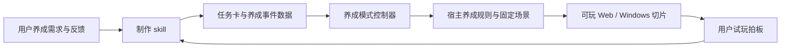

# Godot 养成模式工具包：设计提案

状态：设计稿，2026-10-04。范围按用户最新要求确定为「专门制作养成模式」。制作 skill 已整理为仓库级 0.1.0，入口位于 `.agents/skills/godot-cultivation-mode/SKILL.md`。本文件的运行模块与插件接口仍是设计提案，尚未迁移 shu 代码、实现插件或安装全局 skill。新增架构均为提案；仓库已有批准决定继续有效。

工具包定位为 **Godot 养成模式工具包（暂名 Cultivation Mode Kit）**：制作方法放进 skill，养成循环与场景表现放进 GDScript addon，活动和互动事件放进版本化数据。用两个真实养成用例证明复用，再做编辑器插件。底层继续使用 Godot 的渲染、输入与导出能力。

核心流程：**选择养成行动 → 检查资格 → 行动或人物/支线事件 → 按规则结算 → 返回行动面板 → 继续养成。** 职责覆盖固定场景面板、养成行动、成长反馈、人物互动、tea 等支线与环境表现。支线可包含固定场景访问、调查物件、阅读文书和短回忆。自由探索地图、战斗、独立剧情模式与其他玩法仍不由这个 skill 承接。

## 1. 固化你的制作方法

每一轮遵循：**你给剧情或方向 → Codex 做小型可玩切片 → 你试玩拍板 → Codex 修订 → 更新决定与下一步。**

你可以提供养成玩法、人物关系或剧情片段。Codex 提取约束，将选定内容接入养成场景中的活动或人物事件。合理的默认切片是一个场景、一项行动或一次互动、一个结算结果，以及返回面板后继续行动。较长剧情只接入与本轮养成相关的段落，保留原稿的设定与结局约束。

每轮交付应直接回答三个问题：玩家这次能做什么；哪些地方请你试玩拍板；已验证到什么程度。反馈可以很简短，例如“雨再轻一点”“师叔语气再拐弯一点”“这段通过”。Codex 将其转成有来源的修订记录，避免下一轮重问或遗忘。

只改一句对白或一个布局细节时，复用当前任务卡，修改对应数据并检查受影响分支或画面；不必新建切片、提取框架或重跑无关平台检查。仓库要求的必读资料仍需读取。

继承 shu 已确认方向：Godot 4 稳定版 + GDScript、Web 首发并为后续 Windows/Steam 保留同一工程；固定背景与面板、宋式中国画、Q 版人物、养成画面内师长互动。D01 当前锁定 4.7.2 stable；工具包不能擅自升级。

## 2. 三个部分各自负责什么

| 部分 | 职责 | 主要产物 |
| --- | --- | --- |
| 制作 skill `godot-cultivation-mode` | 读取养成需求和事件约束、选择已有行动、制作与验收养成闭环、落实反馈 | 任务卡、改动、验证证据、决定记录 |
| Godot runtime addon | 活动菜单、资格检查、时间精力与成长结算、人物事件占用与返回、场景表现 | 可复用 GDScript；宿主规则保留数值权威 |
| 养成内容与配置 | 活动引用、人物事件、固定场景、热点、音画提示及来源 | 活动索引、事件 JSON、SceneProfile、素材索引 |



**代码的权威版本放在游戏仓库的 addon 中。** skill 只保存制作规则、合同与样例，并记录兼容版本；编辑器插件也引用这份运行时。避免 skill、游戏和插件各维护一份相同代码。

## 3. 可复用代码怎样拆

第一版规划的目录如下；这些是将来实现的文件名，不代表当前已存在。

```text
addons/cultivation_mode/
  mode_controller.gd     # 活动面板、占用、结算反馈与返回
  activity_catalog.gd    # 行动入口、资格与宿主规则引用
  content_loader.gd     # 养成事件加载与引用检查
  interaction_runner.gd # say / choice / cue / end；养成内人物互动
  action_gateway.gd       # 已登记行动；验证后一次提交，返回实际结果
  mode_state_port.gd     # 宿主时间/精力/成长接口，快照含事件进度及回执
  scene_profile.gd       # 逻辑画布、人物位置、热点、雨区、风层、遮挡
  presentation_port.gd   # 场景请求与事件；不绑定具体 UI
  adapters/shu_panel.gd   # 接当前固定背景与面板
content/cultivation/     # 活动与人物事件数据，位置待仓库接入时确认
```

| 现有代码 | 提取方式 | 首轮边界 |
| --- | --- | --- |
| shu `scripts/demo_state.gd` | 保留现有数值规则，经 ActionGateway 调用 | 修炼、休息、请教及选择；一次提交，返回实际消耗/收益 |
| shu `scripts/main.gd` | 保留现有画面，通过适配器消费对白与结果 | 将分散的忙碌、对话、继续按钮状态收敛成一个互动阶段 |
| shu `scripts/weather.gd` 与 shaders | 将场景坐标、雨区、材质目标、资源路径移入 SceneProfile | 保留已通过的视觉表现，UI 不受环境光影响 |
| 已有 `painted-scene` 模板 | 对适合的分层 Node2D 场景复用投影、风层、遮挡、人物明暗等接口 | 当前 shu 是 Control 面板，先保留其适配器；不能直接替换为另一套坐标模型 |

先在授权的第二段真实内容中确认共用点，再抽取；提取前后保持两段行为一致。只有一处使用、尚未证明可复用的代码继续留在宿主游戏。若需要单独开展研究性提取，应明确其范围和验收，而不是将设计稿当成实施授权。

宿主规则拥有时间、精力、成长及已有关系状态；模式控制器负责显示资格、占用当前互动、展示结算及回到可行动状态。修炼、休息、请教引用同一份权威规则。事件内行动被拒绝时不扣费，保留占用并进入失败对白；只有结束、取消或不可恢复退出才释放。已完成结算不会因返回而自动退款。关系或日程系统只在具体养成需求出现时补充。

天气采用独立的表现时钟与质量设置；游戏时间按养成规则结算。风雨动画不能暗中推进一天、消耗精力或改变玩法随机结果。事件中的“突然下雨”通过白名单表现提示请求。静态和低质量模式仍能完成同样的养成行动。

移动人物或改变层级时，环境光采样必须使用共享场景坐标；现有 `add_lit_art` 记录初始位置的做法，只能作为固定人物的首轮适配，不直接当成通用移动人物实现。

## 4. 养成活动与事件数据

活动索引登记行动名称、资格检查、宿主规则引用和可选人物事件。修炼或休息可以直接结算，请教或同门互动可以打开事件。见 [活动索引样例](../.agents/skills/godot-cultivation-mode/assets/mode.example.json)，数值引用现有宿主规则，保留加成与上限。事件声明所属养成场景、触发活动、参与人物、可调用行动及结束后返回行动面板。

事件内部第一版只支持四种节点：

| 节点 | 含义 | 数据边界 |
| --- | --- | --- |
| `say` | 显示一句对白，玩家继续 | 人物 ID、正文、下一节点 |
| `choice` | 显示选择，必要时请求已有行动 | 选项 ID、文字、行动 ID、成功/失败去向 |
| `cue` | 请求天气、表情或音效表现 | 已登记提示 ID；不修改游戏数值 |
| `end` | 结束本段 | 结束原因与下一步说明 |

多阶段支线增加支线/阶段 ID、前置旗标与一次性完成记录；固定场景、物件、文书和短回忆通过登记的 cue 接入。调查或观察事件可以没有属性收益；成本和奖励由明确的宿主规则决定。见 [支线接入参考](../.agents/skills/godot-cultivation-mode/references/side-quests.md) 和 [tea 阶段样例](../.agents/skills/godot-cultivation-mode/assets/tea-chain.example.json)。这些新增接口仍为设计提案。阅读确认使用绑定会话、节点和提示实例的接口；确认前不推进，取消或重置后的旧确认无效。

正文引用稳定 ID，例如 `mentor_zhixian`，显示名来自人物表。行动引用稳定 ID，例如 `mentor.ask_breathing`，代价来自宿主规则；UI 根据行动返回值显示真实结果。剧情文本中不执行 GDScript，也不内嵌“精力减 10”等另一份数值规则。

选项条件第一版仅需要已登记布尔旗标的相等判断。暂不增加表达式语言、战斗框架、通用任务编辑器或任意脚本节点。发现真实剧情无法表达时，先记录具体例子，再扩充合同。

接入前检查人物、场景、行动、提示与节点引用；所有节点需从入口可达，且能到达结束节点。未知 ID 报告文件、节点与缺少的能力，不静默跳过。节点正文与原稿分开存放，标明哪些内容是原文、改写或新拟对白。

每次行动由模式控制器分配稳定的 `operation_id`，例如当前存档、互动会话和选项的一次操作。宿主先验证再原子修改状态，记录回执；重试返回相同结果，拒绝同 ID 不同参数。请求失败不改数值。重置建立新会话，允许新一轮正常行动。跨存档恢复时，进度、回执和游戏状态必须一起恢复。

具体合同与 GDScript 调用形状见 [运行时合同](../.agents/skills/godot-cultivation-mode/references/runtime-contract.md)。事件的 JSON 形状见 [养成事件样例](../.agents/skills/godot-cultivation-mode/assets/episode.example.json)：它是格式演示，新对白未成为批准剧情。

## 5. 原稿、可运行内容与来源

尊重 shu 当前规则：主线原稿进入 `jggagi/shu/trunk/`；新支线原稿进入独立 `jggagi/sub`。历史 `shu/story/sub/` 内容保持原状。不存在的目标仓库或目录须报告，不自动改用另一个永久归档位置。

可运行内容随游戏版本保存，并用 source manifest 指向原稿仓库、路径、commit、所用段落、内容 hash 和改写说明。构建使用已固定版本的本地数据，不在运行时拉取剧情仓库。剧情草稿不等于授权实施；用户选中某段用于制作后才进入当前切片。

《两盏茶》的已确认原稿仍在历史 `story/sub/tea/README.md`。本 skill 已纳入这类支线的接入设计；不迁移原稿，不把整条支线自动加入当前 demo。实际制作时按 A–I 与结尾逐段接入，维持信息顺序和同一茶杯的前后交互。

人物沿用批准概念图名单：江砚秋、沈听岚、唐小棠、顾云舟、叶知闲、陆停云、唐见青、玄石真人、余观涛。具体 ID 与仓库人物表一致。余观涛保留已批准的师叔定位与人物原型方向，对白与美术原创。

代码、原稿、概念图与生成素材分别记录来源和许可。未来对外分发插件前再确定许可范围，不能把整套素材默认标成 MIT 或 CC0。

## 6. 如何减少 token 消耗

节省主要来自重复工作的消除：新增养成活动或人物事件复用时间精力结算、对白、天气、结果展示和检查；每次模型只需理解当前事件与受影响的规则接口。

| 做法 | 具体落点 | 防止资料过时 |
| --- | --- | --- |
| 精简入口 | 项目摘要链接到当前批准方向、当前切片、接口索引 | 原始规格与决定仍为权威；摘要带版本/hash |
| 按依赖读取 | 任务卡列出当前剧情段落、人物、场景、行动和素材 | 文件 hash 变化后重新读取相关依赖 |
| 标准养成合同 | 固定活动/人物 ID、宿主规则引用、事件节点与返回面板 | 合同版本变化时重检内容 |
| 可重复工具 | 以后提供索引、合同检查、切片证据收集脚本 | 成功只给简短摘要，失败定位到节点 |
| 只记变化 | 反馈写入当前任务卡；决定记录保留来源 | 未确认提案不进入批准规格 |
| 限定改单 | 普通对白改动只改数据；新能力才改 addon | 第二个真实用例验证提取是否成功 |

当前 AGENTS 要求依次读取 README、SPEC、DECISIONS、DEVELOPMENT，skill 必须遵守。未来如果日志明显变长，单独提议调整仓库入口规则：精简当前状态，按索引读取对应历史。未经规则变更不能声称这些必读文件已可跳过。

计划的 `prepare_slice` 工具输出选定依赖、版本/hash、明确约束和文件清单，使用确定性提取，避免反复调用模型总结。超过上下文预算时报告需要拆分的剧情段落；不能截掉结局、人物禁改条件或源文件引用来凑预算。

不预先承诺固定节省百分比。以同类切片比较输入上下文量（可用时记录实际 token；字符数另标）、重复读取次数、修改运行时代码量、修订轮次、最终验收结果。省 token 以剧情保真和可玩验收通过为前提。

## 7. 什么时候做 Godot 编辑器插件

运行模块稳定、两个实际内容都能复用后，再增加一个小型 `EditorPlugin`。Godot 官方支持用 GDScript 实现编辑器插件、定制节点和 dock；通常无需修改或重新编译引擎。[官方插件文档](https://docs.godotengine.org/en/stable/tutorials/plugins/editor/making_plugins.html)

第一批编辑器功能只做：

1. 选场景，拖人物和热点，编辑雨区、风层与遮挡。
2. 编辑养成活动引用与人物事件，检查缺失引用，预览对白、选择和结算反馈。
3. 一键运行当前切片，切换动态/静态和质量档。

编辑器功能与运行时代码分目录，插件 dock 不参与 Web/Windows 游戏运行。内部 SceneProfile 可用 Godot Resource 保持 Inspector 编辑体验；外部剧情数据采用 JSON，入口统一检查与转换，避免长期维护两套不同权威数据。[官方 Resource 文档](https://docs.godotengine.org/en/stable/tutorials/scripting/resources.html)

后续发展方向保持为养成模式运行模块与编辑工具：反复制作行动、成长反馈和人物事件时逐步补齐能力。Godot 继续承接渲染、输入、导出与平台支持。

## 8. 分阶段实施与验收

| 阶段 | 工作 | 验收条件 |
| --- | --- | --- |
| P0 本轮 | 养成模式 skill、活动/事件合同与样例 | 范围与结构检查；明确待实现部分 |
| P1 第二真实用例 | 下一 chat 从 tea 的 A/B 小切片开始，具体实施见交接说明；余观涛用例留待后续安排 | 委托、两杯调查、阶段旗标及返回养成形成闭环；现有 D01 保持 |
| P2 抽取共用模块 | 根据两个养成用例提取模式控制器、行动接口、人物事件和场景配置 | 两段都能结算并继续养成；不重复扣费；Web/Windows 验证分别记录 |
| P3 养成事件/支线试投 | 提供新行动、人物事件或 tea 的一个选定阶段，制作约 3–5 分钟切片 | 规则、故事约束与信息顺序符合要求；中断、重访和返回正常，可继续养成 |
| P4 便捷编辑 | 在实际反复调整的数据上做插件面板 | 修改保存后可重新加载、引用检查、插件关闭/重开无残留 |

P1/P2 按实际改动检查修炼的时间/精力消耗与成长、休息的精力上限与时间、资格不足不扣费、连点不双扣、人物事件结束/取消/失败后继续行动、返回与重置、窗口缩放与 UI 阅读；合同加载落地时检查坏引用，天气迁移时检查其与玩法状态的独立性。存档落地时增加回执与事件进度共同恢复的检查。

人物 ID 已批准不意味着对应立绘已准备好。新增余观涛时先核查素材索引；没有合适立绘，可以沿用场景作文字出场，或按授权补素材，不把叶知闲贴图改名当成余观涛。

每阶段按可审查结果拆小提交；是否保存到 GitHub、是否发布插件，沿用该任务已有授权。这里没有把设计提案写成仓库批准决定。

## 9. 下一次你怎样给养成需求

最省事的输入可以是：

> 做一段余观涛在听雨廊考察江砚秋的剧情。他表面温和，话里有试探；两种回应都能继续修炼，但人物反馈不同。先做五分钟可玩版本，沿用现有美术。

这是输入格式示例，不是新批准剧情。Codex 会把实际输入整理成 [养成任务卡](../.agents/skills/godot-cultivation-mode/assets/slice-card.template.md)，引用现有规则与人物事件能力，列出结算和返回面板的验收点，再开展授权制作。通常只追问影响玩法规则、设定或实施边界的关键缺项。

本包的 [制作 skill](../.agents/skills/godot-cultivation-mode/SKILL.md) 可作为后续安装和接入的起点，专门支持现有 shu 项目的养成模式。工具包尚未实现时会识别现状，不调用不存在的接口。


## 收尾与下一 chat

本轮仅保存制作 skill、样例、检查工具及文档。下一轮从 [tea 交接说明](TEA_HANDOFF.md) 开始制作；现有 D01-weather3 仍为可玩基线。检查证据见 [收尾检查](CULTIVATION_MODE_CHECKS.md)。本 skill 是仓库级版本，未改用户级安装、引擎版本或全局设置。
